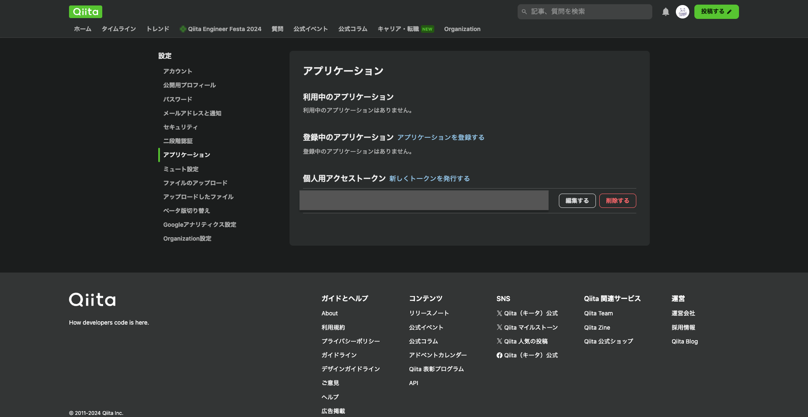
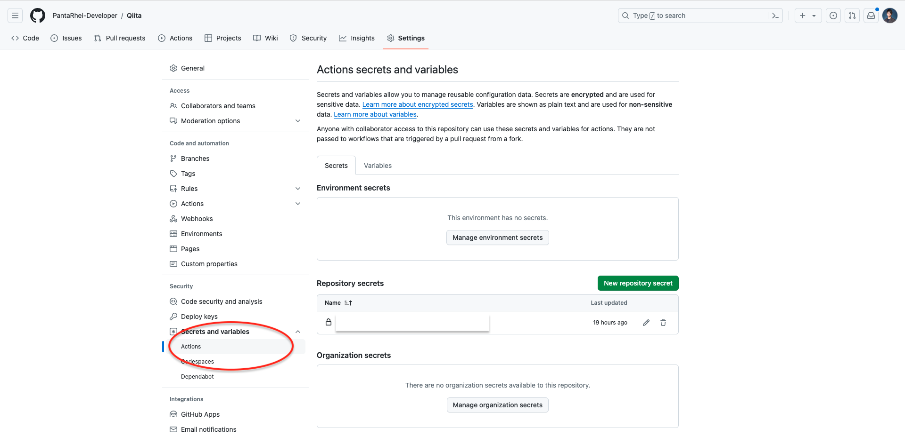
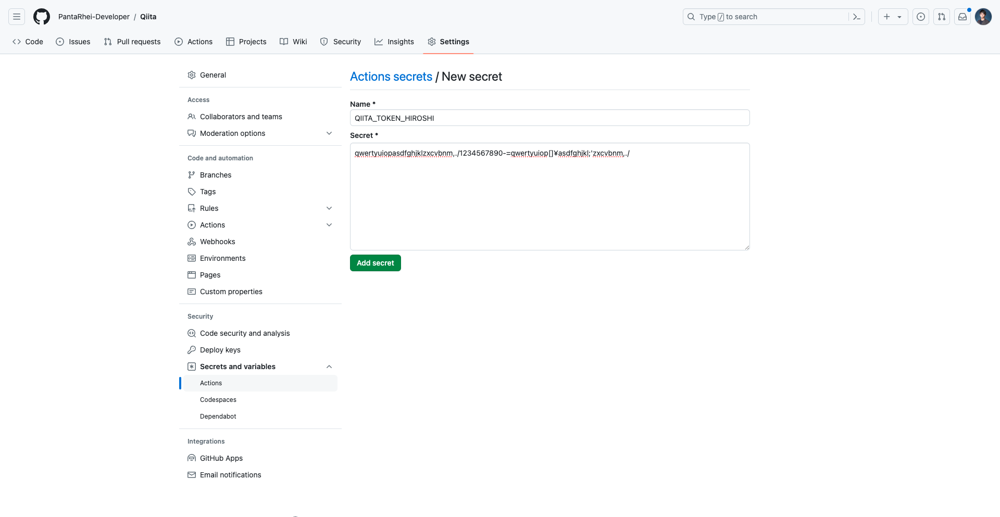
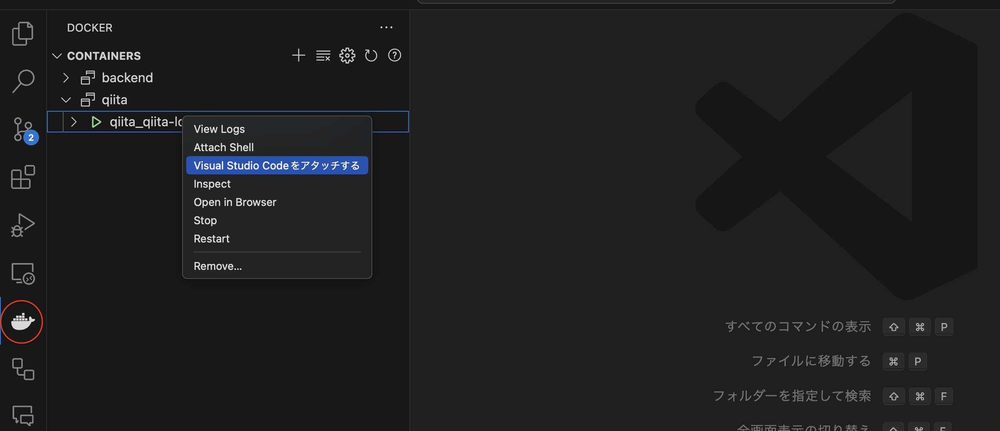

# Qiita

本レポジトリはQiitaの記事のアップロードや記事管理をVSCodeでできるようにしたものです！

# 初期手順

<B>前提</B>
- githubのアカウントを持っている
- Qiitaアカウントを持っている
- Panta RheiのOrganizationに入っている
  (入っていない場合はかずさんに相談してください！)

## 0. Qiitaでトークンを発行します
Qiitaにログインして、自分のアイコンをクリック>設定>アプリケーションに進んでください。

ここで個人用アクセストークンを新規発行してください。

この時の名前はなんでも良いですが、[Qiita公式レポジトリ](https://github.com/increments/qiita-cli?tab=readme-ov-file#qiita-%E3%81%AE%E3%83%88%E3%83%BC%E3%82%AF%E3%83%B3%E3%82%92%E7%99%BA%E8%A1%8C%E3%81%99%E3%82%8B)では、```qiita-cli```という名前をつけています。

ここで得られたトークンはこの後使います&<B>忘れたら絶対に元に戻らない</B>ので個人で各〻保管しておいてください。

## 1. Github ActionsにQiita Tokenを保存する

[Qiitaのレポジトリ](https://github.com/PantaRhei-Developer/Qiita/tree/dev)にアクセスして、Settingsタブを押します。
サイドバーの```Secrets and variables```から```Actions```を選択してください。



 その後、```New repository secret```を押して、新規トークン保存画面になったら、

 Nameに

 ```
 QIITA_TOKEN_{}
 ```
と入力してください。```{}```はあなたの好きな識別子で大丈夫です。

例: ```QIITA_TOKEN_HIROSHI```

但し<B>他のトークン名とは被らないようにしてください。</B>

以下例の画面です。



その後、Secretに0.で取得したQiita Tokenを貼り付けて```Add secret```してください。

## 2. githubからレポジトリを取得し、ブランチをdevにします

クローンして
```bash
git clone git@github.com:PantaRhei-Developer/Qiita.git
```

レポジトリに入り
```bash
cd Qiita
```

ブランチを```dev```に変更します。
```bash
git checkout -b dev
```

## 3. nodeのDocker環境を立ち上げて入ります

Docker環境をビルドしてランします。
```bash
docker compose up
```

その後、そのDocker環境の中に入ります。

[Dev Container](https://zenn.dev/bells17/articles/devcontainer-2024)という素晴らしいVS Codeのエクステンションがあるので、それを入れてその環境に入ることをお勧めします。

エクステンションを入れた後、以下の鯨マークをクリックして```qiita```タブを開いてください。
```qiita_qiita-local```の部分を右クリックすると「Visual Studio Codeをアタッチする」と出てくるのでそれをクリックしてください。



これでDockerの中に入れました。

## 4. .envファイルを```/usr/app```ディレクトリに記載します

.envファイルを作成します。```/usr/app```ディレクトリで、

```bash
vim .env
```

などとします。

(.envファイルに以下の設定だけ書ければ良いので、エディタはなんでも大丈夫です)

その```.env```ファイルに以下のように書いてください。

```
QIITA_TOKEN = your qiita token name here
```

ここで「your qiita token name here」の部分は、1.で登録したトークンの名前です。
例
```
QIITA_TOKEN = QIITA_TOKEN_HOROSHI
```

## 5. read_env.shを実行して、ローカルの環境をGithub Actionsに反映します。

ディレクトリ等を移動せず以下のコマンドを実行します。

```bash
bash read_env.sh
```

これで、基本的な設定は終了です。

## 補足
```read_env.sh```を走らせると```.github/workflows/publish.yml```に変更が加えられます。
この変更は<B>絶対にcommitしないでください</B>。

## 6. Qiitaアカウントとローカルの紐付け

コマンドラインで以下の設定を行なってください。

```bash
npx qiita login
```
すると以下のように出てきます。
```
以下のURLにアクセスしてトークンを発行してください。（「read_qiita」と「write_qiita」にチェックを入れてください）
  https://qiita.com/settings/tokens/new?read_qiita=1&write_qiita=1&description=qiita-cli
発行したトークンを入力:
```

すでに、0.でQiitaトークンを発行しているので、そのトークンをここに貼り付けます。
以下のテキストが出てくれば成功です。


```
Hi {Qiitaユーザー名}!
```
```
ログインが完了しました 🎉
以下のコマンドを使って執筆を始めましょう！

🚀 コンテンツをブラウザでプレビューする
  npx qiita preview

🚀 新しい記事を追加する
  npx qiita new (記事のファイルのベース名)

🚀 記事を投稿、更新する
  npx qiita publish (記事のファイルのベース名)

💁 コマンドのヘルプを確認する
  npx qiita help
  
```

# 記事の投稿

TBD