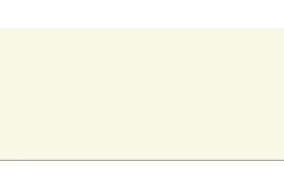

# 初めまして
株式会社 Panta Rhei CEOのかずです。[Pandasista](https://x.com/sotsogprinciple)というハンネでツイッターをやっています。pandas大好きです。データも好き。

# Qiita Engineer Festaでマラソンを完走したい
[Qiita Engineer Festa](https://qiita.com/official-campaigns/engineer-festa/2024)という素敵なイベントがあります。

その中で<B>投稿マラソン</B>という素敵なコースが！！！
なんと「<B>38記事書けば素敵な景品がもらえる！！</B>」らしいです。

20代も後半に差し掛かり、小生もそれなりに蓄えてきたナレッジがあるはず。

集大成をこのフェスタで還元しよう！
1日1記事！頑張ります。

# Google Cloudのプロダクトアイコンを手書きで書く(Compute Engine編)
さて本題です。
弊社では、データを取り扱うという特性から、クラウド基盤もしっかりモダンなものになっています。
用いている基盤はGoogle Cloud。弊社がGoogle Cloud for StartupsのAI企業に認定されているため、かなり活用させていただいております。
ストレージからネットワーク、コンピューティングまで、手前味噌ながら素敵なアーキテクチャを実装しています。

そんな関係から、結構な頻度でホワイトボードや紙にGoogleプロダクトの設計図を書くことがあります。

そんなとき「Google Cloudプロダクトのアイコンをそらで描けたらかっこよくないか？」と思いました。

# Google Cloud Compute Engine (GCE)
<image src="../images/ComputeEngineIcon.png" width="200" caption="Compute Engineのアイコン">

みんな大好きCompute Engineです。今回はこの書き方を共有しようと思います。

もちろん正解ではありませんが、個人的には割とベストな書き方かなと考えております。

## 2通りの書き方

早く書くパターンと綺麗に書くパターンがあります。

## 早く書くパターン
<B>特徴</B>
横と縦に飛び出る棒を一本の線で表記します。

また内部の四角形もただの「囗(くにがまえ)」で表記します。

## 見た目通りに書くパターン

## どっちを用いるべきか
MTGの時なんかは早く書くパターン、社内勉強会の時は見た目通り書くパターンが良いのではないでしょうか。

# 終わりに
弊社は<B>Google Cloud for StartupsのAIスタートアップに認定されているAI企業です</B>。

有り余る技術力により、世のAI活用課題を解決致します。
クラウド基盤から内製化AI、一気通貫のデータ利活用基盤構築まで、何かお困りごとがありましたらぜひ弊社、
[株式会社 Panta Rhei](https://www.pantarhei.co.jp)にご相談ください！
